# Pyrochrome — evaluation report

_Generated 2026-06-28 15:28 UTC · model `hist_gb` · held-out 20% test split (seed 42)._ Regenerate with `make eval`.

## Surface (Glossy / Matte / Satin)

- Accuracy **0.774** · macro-F1 **0.660** · weighted-F1 0.759 · top-2 **0.919**
- Expected calibration error (top label): **0.044** (lower = the confidence % can be trusted more).

| Class | Precision | Recall | F1 | Support |
|---|---|---|---|---|
| Glossy | 0.83 | 0.92 | 0.87 | 1007 |
| Matte | 0.70 | 0.69 | 0.69 | 411 |
| Satin | 0.57 | 0.32 | 0.41 | 259 |

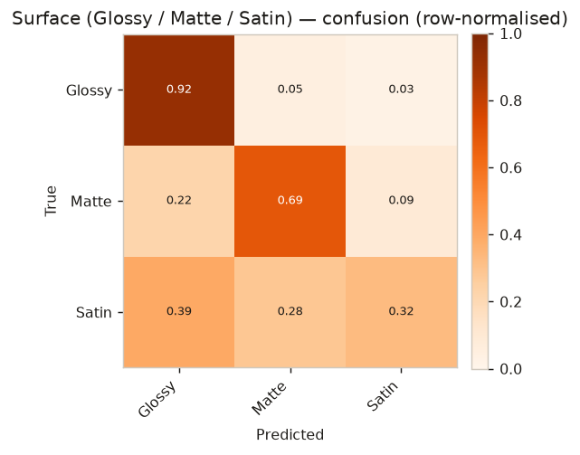

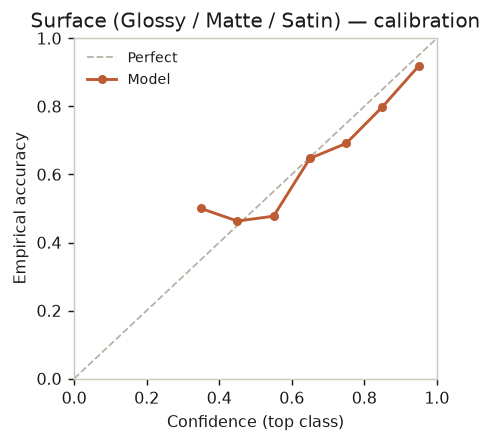 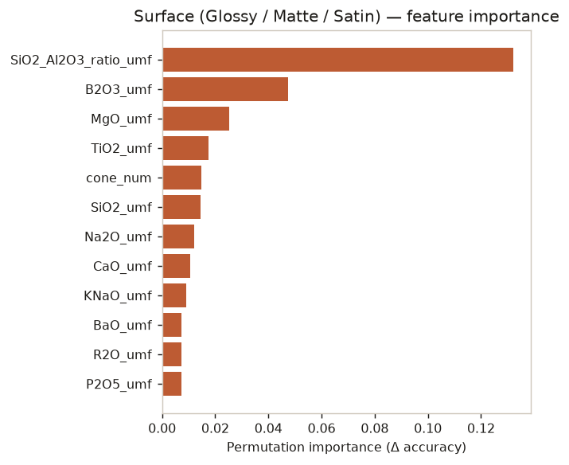

## Transparency (Opaque / Semi-opaque / Translucent / Transparent)

- Accuracy **0.658** · macro-F1 **0.610** · weighted-F1 0.646 · top-2 **0.851**
- Expected calibration error (top label): **0.047** (lower = the confidence % can be trusted more).

| Class | Precision | Recall | F1 | Support |
|---|---|---|---|---|
| Opaque | 0.71 | 0.83 | 0.77 | 605 |
| Semi-opaque | 0.54 | 0.39 | 0.45 | 284 |
| Translucent | 0.57 | 0.48 | 0.52 | 246 |
| Transparent | 0.69 | 0.72 | 0.70 | 241 |

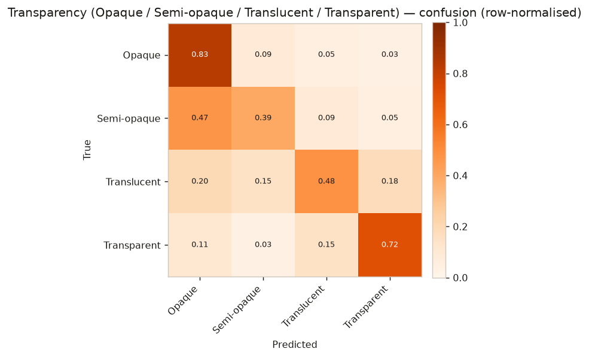

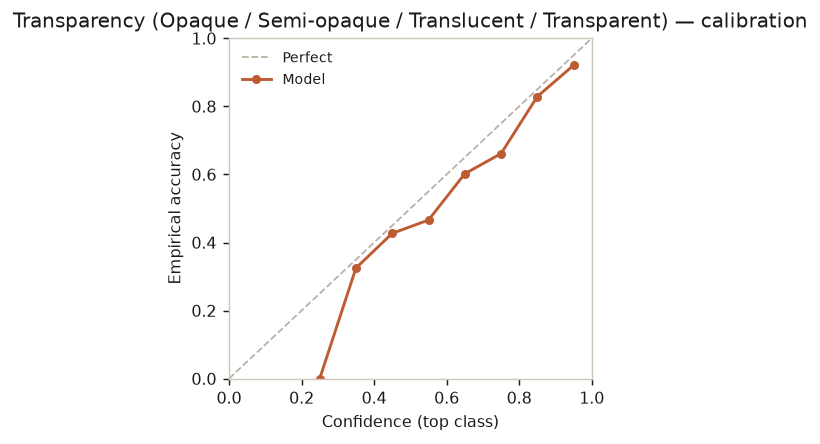 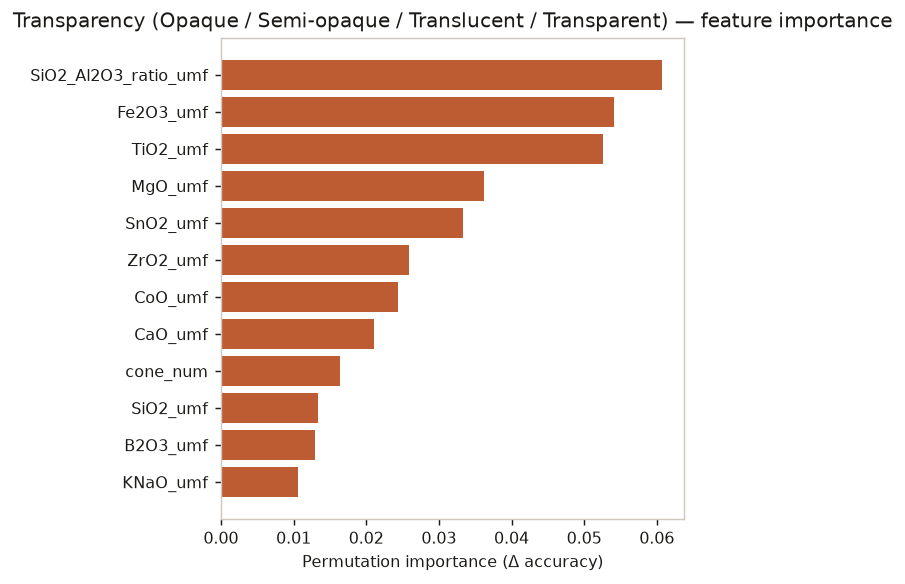

## Colour family (10 classes, from RGB)

- Accuracy **0.663** · macro-F1 **0.519** · weighted-F1 0.648 · top-2 **0.791**
- Expected calibration error (top label): **0.064** (lower = the confidence % can be trusted more).

| Class | Precision | Recall | F1 | Support |
|---|---|---|---|---|
| Blanc | 0.75 | 0.87 | 0.81 | 493 |
| Rouge | 0.60 | 0.63 | 0.62 | 101 |
| Noir | 0.64 | 0.50 | 0.56 | 98 |
| Bleu | 0.59 | 0.61 | 0.60 | 94 |
| Vert | 0.53 | 0.49 | 0.51 | 85 |
| Turquoise | 0.51 | 0.51 | 0.51 | 77 |
| Jaune | 0.55 | 0.31 | 0.40 | 51 |
| Orange | 0.41 | 0.28 | 0.33 | 46 |
| Violet | 0.64 | 0.25 | 0.36 | 28 |
| Brun | 0.61 | 0.41 | 0.49 | 27 |

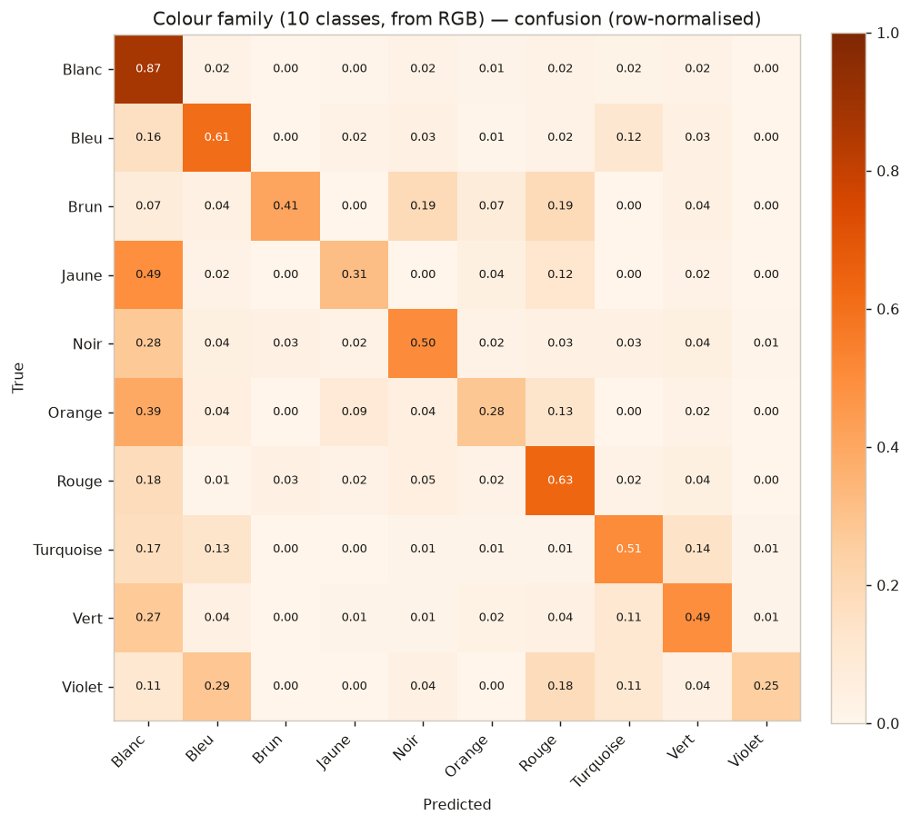

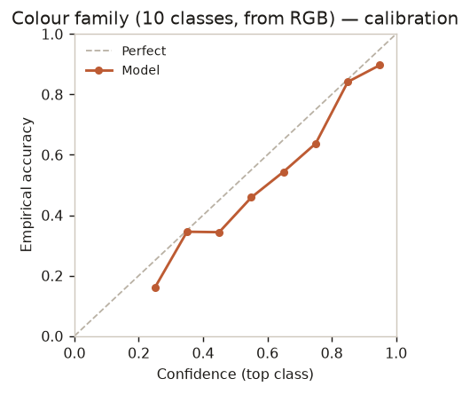 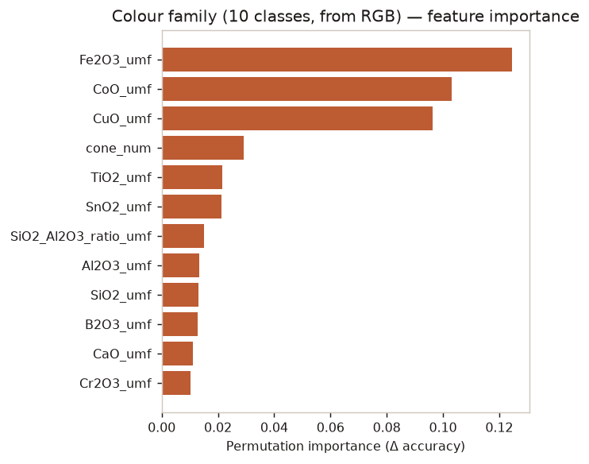

## Colour — Lab regression

- n=1107 · mean ΔE **32.56** · median ΔE 23.49 · R² 0.421
- Per-channel MAE — L* 15.75 · a* 15.45 · b* 17.68
- The large residual ΔE is the photo-label-noise ceiling; see the Docs page.

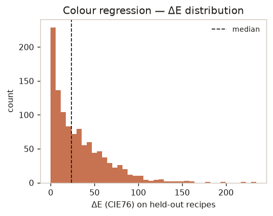

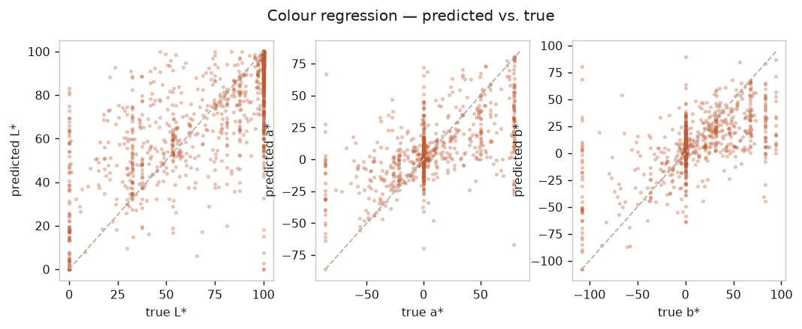
